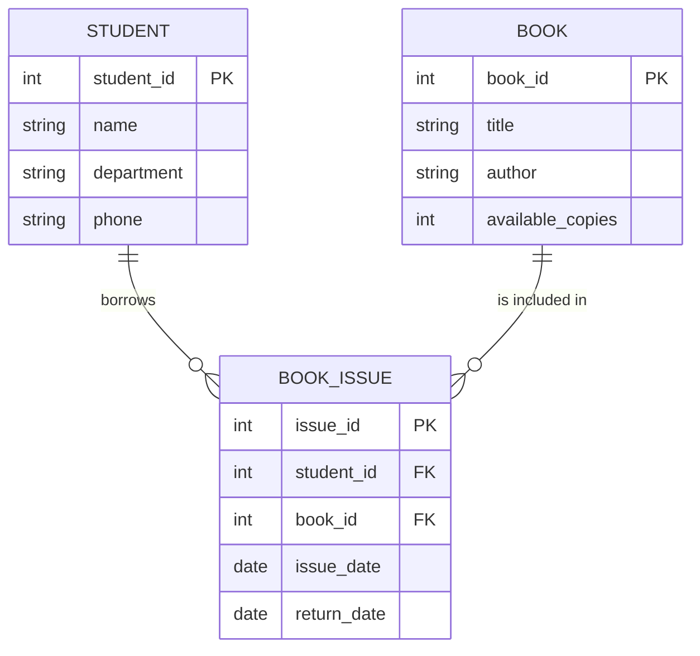

# 📑 SMART LIBRARY MANAGEMENT SYSTEM v2.0 - MICRO PROJECT REPORT

**Submitted to:** Department of Computer Science and Engineering, TIST
**Course:** PCCST402 DATABASE MANAGEMENT SYSTEMS
**Submitted by:** Krishnapriya Rajeev (Reg. No.: TOC24CS103)

---

## 1. ABSTRACT
The Smart Library Management System v2.0 is a modernized full-stack application developed to streamline the administration of academic libraries. Built to replace legacy architectures, this system leverages a React-based frontend for a dynamic user experience and a Node.js/Express backend for robust API management. The core database utilizes MySQL to ensure high-performance data retrieval and storage, incorporating advanced SQL features like Views and Triggers to automate book inventory and audit logs.

## 2. OBJECTIVES
The primary goal is to provide a centralized digital platform for library asset distribution and member tracking.
1.  **Digital Enrollment**: Facilitate seamless student registration and management.
2.  **Inventory Control**: Maintain real-time records of total vs. available book copies.
3.  **Transaction Lifecycle**: Automate the full "Issue to Return" cycle for books.
4.  **Enhanced Visualization**: Provide admins with a statistical dashboard for quick system oversight.

## 3. ENTITY-RELATIONSHIP DIAGRAM


## 4. DATABASE SCHEMA
The system is built on a normalized schema consisting of three core tables:
- **`student`**: Stores personal details and department info.
- **`book`**: Stores metadata including title, author, and current availability status.
- **`book_issue`**: A junction table recording dates for book loans and returns.

## 5. SOFTWARE SPECIFICATION
- **Frontend**: React.js 18 (Vite, Tailwind CSS, Lucide Icons)
- **Backend**: Node.js v18 (Express.js)
- **Database**: MySQL 8.0 (mysql2 driver)
- **Styling**: Premium Glassmorphic Design

## 6. DB CONNECTIVITY & SQL QUERIES
The system connects via a MySQL pool configuration in `db.js`:
```javascript
const pool = mysql.createPool({
  host: process.env.DB_HOST,
  user: process.env.DB_USER,
  password: process.env.DB_PASSWORD,
  database: 'smart_library_db',
});
```

### Core SQL Table Definitions:
```sql
CREATE TABLE book (
  book_id int(11) PRIMARY KEY AUTO_INCREMENT,
  title varchar(255) NOT NULL,
  author varchar(255) NOT NULL,
  total_copies int(11) NOT NULL,
  available_copies int(11) NOT NULL
);
```

## 7. CONCLUSION
The Smart Library Management System successfully implements modern web technologies to solve traditional library management challenges. By utilizing advanced database triggers and views, the system minimizes human error in inventory tracking and provides an efficient, responsive, and secure platform for both librarians and students.
